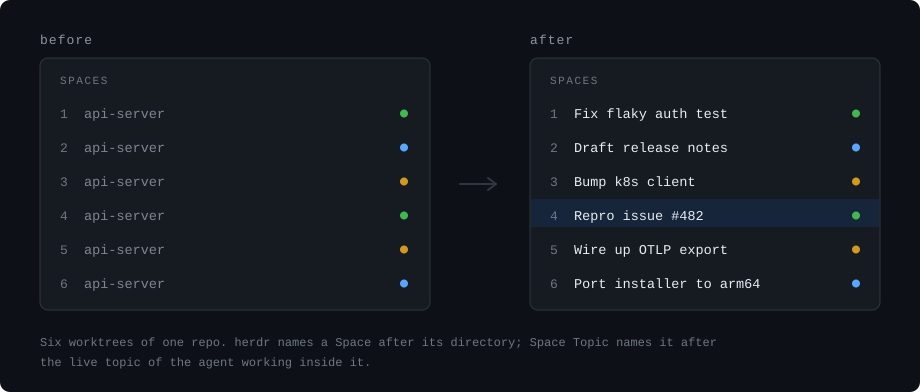

# herdr-space-topic

> herdr plugin: name each **Space** after the work happening inside it, instead of after its directory.

herdr labels a Space from its directory, so several worktrees of one repo all
read the same name in the sidebar and you have to open each one to remember
what it is doing.



<sub>Illustration — labels are examples, not a capture of a real session.</sub>

Agents already say what they are working on: Claude Code, Codex and friends set
the terminal title, and herdr exposes it per pane as `terminal_title_stripped`.
This plugin picks the pane that leads each Space and writes that topic onto the
Space itself.

It is the Space-level companion to
[`danbuhler/herdr-pane-topic-sync`](https://github.com/danbuhler/herdr-pane-topic-sync),
which does the same for panes and tabs. The two compose: panes and tabs from
that one, Spaces from this one. Neither needs the other.

## Install

```bash
herdr plugin install panuhorsmalahti/herdr-space-topic
```

Requires herdr >= 0.9.0 and `node` >= 18 on your `PATH`. No npm dependencies,
no build step, no API key — the topic is already on the server.

Look before you leap. `preview` walks the session and prints what it *would*
rename, writing nothing:

```bash
herdr plugin action invoke phorsmalahti.space-topic.preview
herdr plugin log list --plugin phorsmalahti.space-topic   # actions log, not tty
```

Actions are refused while a plugin is disabled (`plugin_disabled`), so that
only works once the plugin is enabled — by which point it has already renamed
on the first event. To see the plan *before* anything is written, run the
script directly from the plugin directory instead:

```bash
node sync-space-labels.js --dry-run
```

It prints to your terminal, reads the same live session through the `herdr`
CLI, and needs no plugin context. `restore` undoes the lot either way.

## How a Space gets its name

1. **Pick the pane that speaks for the Space.** By default that is reading
   order — lowest tab number, then top-left. A pane that is an agent *and* has
   a topic beats one that is only an agent, so a leading shell pane does not
   silence the Space. Set `source = "active"` to follow the focused pane inside
   that Space instead.
2. **Take its topic** — `terminal_title_stripped`, the agent's live terminal
   title with the spinner glyph removed.
3. **Format and truncate it**, then write it with `herdr workspace rename`.

When there is no topic yet — agent still starting, plain shell, agent exited —
`fallback` decides: the original label, the Git branch, the directory basename,
or leave the sidebar alone.

## Your own names win

Rename a Space by hand and the plugin stops writing to it. It tracks the labels
it has written; a live label it does not recognise is a name you typed, and it
leaves it alone from then on.

To hand a Space back, rename it to its original label, or run:

```bash
herdr plugin action invoke phorsmalahti.space-topic.adopt   # from that Space
```

To undo everything:

```bash
herdr plugin action invoke phorsmalahti.space-topic.restore
```

`restore` puts back the label each Space had the first time the plugin saw it,
and forgets its state. It only reverts Spaces still carrying a label the plugin
wrote — one you renamed yourself is left as you left it.

## Non-destructive mode

`mode = "rename"` overwrites the Space label, which is what makes it work with
no setup. If you would rather keep your labels, use `mode = "token"`: the topic
is published as a workspace token via `herdr workspace report-metadata` and
your label is never touched. Then place `$topic` in a Space sidebar row in your
herdr config. `mode = "both"` does both.

## Configuration

Optional. Every key has a default; see
[`examples/default-config.toml`](examples/default-config.toml) for the annotated
list.

```bash
cp examples/default-config.toml "$(herdr plugin config-dir phorsmalahti.space-topic)/config.toml"
```

| key | default | what it does |
| --- | --- | --- |
| `enabled` | `true` | turn the plugin off without unlinking it |
| `mode` | `"rename"` | `rename`, `token`, or `both` |
| `token_name` | `"topic"` | token name for `token`/`both` (`$topic` in a Space row) |
| `source` | `"first"` | which pane speaks for the Space: `first` or `active` |
| `fallback` | `"original"` | with no topic: `original`, `branch`, `cwd`, `keep` |
| `format` | `"{topic}"` | `{topic} {agent} {original} {branch} {cwd} {number} {status}` |
| `max_label_length` | `40` | truncate after formatting (clamped 8–80) |
| `respect_manual_names` | `true` | never overwrite a Space you renamed |
| `require_agent` | `true` | only manage Spaces that host an agent |
| `skip` | `[]` | workspace ids or exact labels to never touch |

A couple of formats worth trying:

```toml
format = "{agent} › {topic}"     # claude › Fix flaky auth test
format = "{branch} · {topic}"    # fix-auth · Fix flaky auth test
format = "{number}· {topic}"     # 2· Fix flaky auth test
```

## When it runs

herdr runs the script on the events in
[`herdr-plugin.toml`](herdr-plugin.toml): Space, tab and pane lifecycle and
focus, plus the one that carries the topic — `pane.agent_status_changed`, an
agent flipping idle↔working, which is when it names the task it just started.

herdr 0.9 has no plugin hook for a bare terminal-title change:
`pane.updated` exists as a socket subscription but is rejected as a hook name,
so a topic the agent rewrites mid-turn lands on the next status flip rather
than instantly. Run the `sync` action to force one.

It deliberately does **not** subscribe to `workspace.renamed`: its own renames
emit that event, and it would re-trigger itself forever.

There is no daemon. Each run is a short walk of `workspace list`, `tab list`
and `pane list` that exits when it is done, and it writes only when a label
actually changes.

## Notes

- **Concurrency.** herdr fires several of these events at once, so copies of
  the script run concurrently. State is a short history of labels per Space
  rather than one string, so concurrent runs merge instead of clobbering, and
  writes to the state file are atomic.
- **State** lives in `HERDR_PLUGIN_STATE_DIR`. Delete it and the plugin treats
  the labels currently on screen as the originals — `restore` then puts those
  back rather than the directory names.
- **Git.** `branchOf` only shells out to `git` when `fallback = "branch"` or
  your `format` contains `{branch}`.
- **Verified** against herdr 0.9.0 on macOS with Claude Code and Codex panes.
  `min_herdr_version` is `0.9.0` because that is what it has been run against,
  not because older versions are known to break.

## License

MIT
